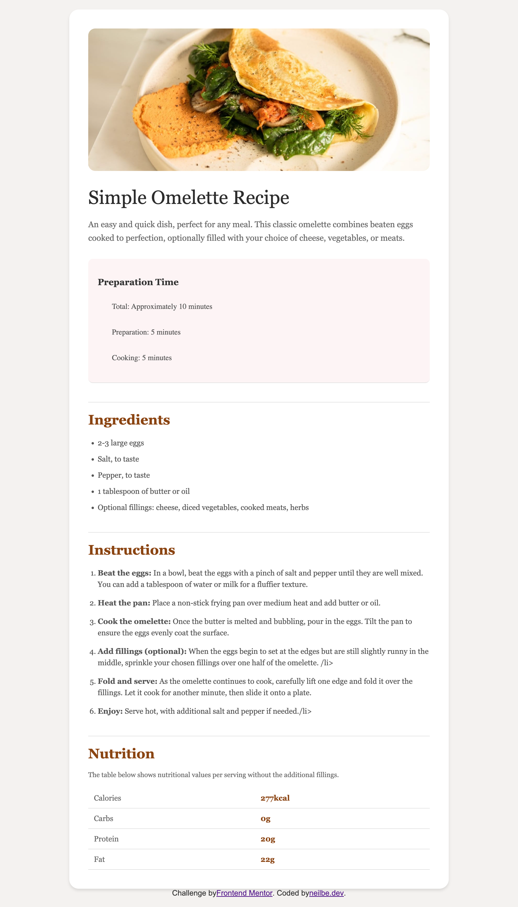

# Frontend Mentor - Recipe page solution

This is a solution to the [Recipe page challenge on Frontend Mentor](https://www.frontendmentor.io/challenges/recipe-page-KiTsR8QQKm). Frontend Mentor challenges help you improve your coding skills by building realistic projects.

## Table of contents

- [Overview](#overview)
  - [The challenge](#the-challenge)
  - [Screenshot](#screenshot)
  - [Live preview](https://nbwedev.github.io/recipe-page/)
- [My process](#my-process)
  - [Built with](#built-with)
  - [What I learned](#what-i-learned)
  - [Useful resources](#useful-resources)

## Overview

### Screenshot



## My process

### Built with

- Semantic HTML5 markup
- CSS custom properties

### What I learned

I learned that the best way to use the image in this case is through CSS, not HTML. Since the image is meant to be decorative, I used it as a background image in a `<div>`. This way, it doesn’t appear as content but serves purely as visual design. Here’s a snippet from the project I created:

```html
<div class="image-omelette"></div>
```

```css
.image-omelette {
  width: 100%;
  height: 300px;
  background: linear-gradient(100deg, #f4e4a6 0%, #d4b896 100%);
  background-image: url(assets/images/image-omelette.jpeg);
  background-repeat: no-repeat;
  background-size: 100%;
}
```

I learned that CSS media queries help make a webpage more responsive by adjusting the layout for different screen sizes.

### Useful resources

Mostly research (MDN, StackOverflow, ChatGPT, Claude)
